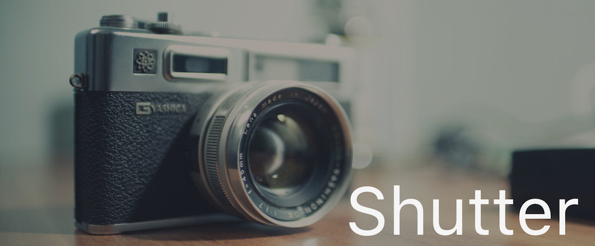

[](https://jitpack.io/#levibostian/Shutter-Android)
[](https://github.com/JStumpp/awesome-android/blob/master/readme.md#utility)

# Shutter-Android
It's finally easy to take photos/videos via camera or get photos/videos from gallery on Android.



### What is Shutter?

Shutter is an Android library to take photos, record videos, pick images/videos from gallery, with ease. I always have difficulty working with images/videos while developing Android apps *especially since file providers were added*.

### Why use Shutter?

* Less bugs. No more publishing apps and have your app crash on a user's devices because of file permission issues you did not handle or boilerplate code you forgot to include (believe me, I have done this many times).
* No more copy/paste of boilerplate code. Install lib, call Shutter, and be done across all of your apps.
* Lightweight. [Check out the methods count here](http://www.methodscount.com/?lib=com.github.levibostian%3AShutter-Android%3A0.1.0)
* No Android runtime permissions needed. No need to ask for reading/writing files permissions.
* Java and Kotlin support. Shutter-Android is written in Kotlin :)

## Install

Install Shutter-Android via [JitPack.io](https://jitpack.io/#levibostian/Shutter-Android).

Add the following to the root build.gradle file (/build.gradle) at the end of repositories:

```
allprojects {
	repositories {
	    ...
		maven { url 'https://jitpack.io' }
	}
}
```

Then, add the following to your project build.gradle file (app/build.gradle)

```
dependencies {
    compile 'com.github.levibostian:Shutter-Android:0.2.1'
}
```
(the latest release to date is version: [](https://jitpack.io/#levibostian/Shutter-Android))

## Take images easily with Shutter

When you want to take a photo in your Activity or Fragment, call Shutter:

```
shutterResultListener = Shutter.with(this)
    .takePhoto()
    .usePrivateAppInternalStorage()
    .snap(object : Shutter.ShutterResultCallback {
        override fun onComplete(result: Shutter.ShutterResult) {
            result.absoluteImageFile // <--- file:// path to the image.
        }
        override fun onError(humanReadableErrorMessage: String, error: Throwable) {
            Log.d("SHUTTER_EXAMPLE_APP", "Error encountered: ${error.message}")
            Snackbar.make(findViewById(android.R.id.content), humanReadableErrorMessage, Snackbar.LENGTH_LONG).show()
        }
})
```

If you want to record a video, use: `Shutter.with(this).recordVideo()`. Pick image from the device gallery, use: `Shutter.with(this).getPhotoFromGallery()`. Pick video from the device gallery, use: `Shutter.with(this).getVideoFromGallery()`.

When you call `.snap()` to tell Shutter to take a photo, save the result object. You will need to call if on your Activity or Fragment's `onActivityResult()` call:

```
override fun onActivityResult(requestCode: Int, resultCode: Int, data: Intent?) {
    if (!shutterResultListener!!.onActivityResult(requestCode, resultCode, data)) {
        super.onActivityResult(requestCode, resultCode, data)
    }
}
```

Shutter-Android uses the [FileProvider API](https://developer.android.com/reference/android/support/v4/content/FileProvider.html) to take photos. Because of this, Android requires you to add the following to your manifest file:

```
<application
   ...>
    <provider android:name="android.support.v4.content.FileProvider"
              android:authorities="${applicationId}.fileprovider"
              android:exported="false"
              android:grantUriPermissions="true">
        <meta-data android:name="android.support.FILE_PROVIDER_PATHS"
                   android:resource="@xml/file_paths" />
    </provider>
</application>
```

Then, create a file: `app/src/main/res/xml/file_paths.xml` to specify permissions of the FileProvider API. For now, this is what the file contents should look like:

```
<?xml version="1.0" encoding="utf-8"?>
<paths>
</paths>
```

Inside of this file, add some entries depending on your situation.

* If you are capturing an image using `.usePrivateAppInternalStorage()` add the following line between <paths> </paths>:

```
<files-path name="internal_pictures_files" path="Pictures/" />
```

* If you are capturing an image using `.usePrivateAppExternalStorage()` add the following line between <paths> </paths>:

```
<external-files-path name="external_pictures_files" path="Pictures/" />
```

* If you are recording a video using `.usePrivateAppInternalStorage()` add the following line between <paths> </paths>:

```
<files-path name="internal_videos_files" path="Movies/" />
```

* If you are recording a video using `.usePrivateAppExternalStorage()` add the following line between <paths> </paths>:

```
<external-files-path name="external_videos_files" path="Movies/" />
```

Here is an example `file_paths.xml` file:

```
<?xml version="1.0" encoding="utf-8"?>
<paths>
    <files-path name="internal_pictures_files" path="Pictures/" />
    <external-files-path name="external_videos_files" path="Movies/" />
</paths>
```

More info about how to specify permissions can be found in the [official docs](https://developer.android.com/reference/android/support/v4/content/FileProvider.html#SpecifyFiles)

Done!

## Author 

* Levi Bostian - [GitHub](https://github.com/levibostian), [Twitter](https://twitter.com/levibostian), [Website/blog](http://levibostian.com)


**Notes/Warnings:**

* The Shutter API might confuse you because you are able to save your captured media to "private internal or external storage" with the option to also "save the captured media to the gallery". This is true but not true.
desi
*TL;DR Your photos/videos captured with Shutter may be added to the public gallery on the Android device no matter how you setup Shutter.*

Android is a fragmented operating system as we all know. Even if you decide to save your photos to private internal storage and not save to the gallery, your photo still *might* be saved to the gallery. Shutter has no control over this. Every user device will behave differently depending on the camera app that is installed. Shutter takes photos by using an Android Intent which asks a camera app on the user's device to take the photo for us. That camera app has the ability to do with your photo whatever it wishes after it is taken including but not limited to saving the photo to the public gallery.

The only way to enforce your photos are private to your app and your app only is to add the camera functionality to your own app which we will not be covering in Shutter at this time and probably never.

"Why does shutter even give the ability to add the captured media to the public gallery if it might do it already?" you answered your own question there. *Might* is the keyword. Adding the ability to add the media to the gallery through Shutter is to assert it is added to the gallery even if the camera app decides not to when the photo/video is captured.

* Create a loading UI while working with Shutter if you decide to show a photo/video after capturing it.

Shutter does labor intensive tasks in a background thread. What this means is that your app will go back into focus right away after the device camera or gallery apps are launched but the photo/video may not be ready for you yet. Shutter will call the callback you give to `.snap()` when the photo/video is ready. When your app goes back into focus, I would make sure to have some sort of loading UI telling the user that you are loading the photo/video and it will be available shortly. Once the callback you send to `.snap()` is called with the file path or an error, then you can change your UI to show the video/image and hide the loading UI.

## Contribute

Shutter is open for pull requests. Please, read the STYLE.md doc in the root of this project which will answer some questions for you as to why Shutter is built the way it is.

## Credits

* API design inspiration came from the [kayvannj PermissionUtil library](https://github.com/kayvannj/PermissionUtil). Check this library out for an awesome way to work with Android permissions.